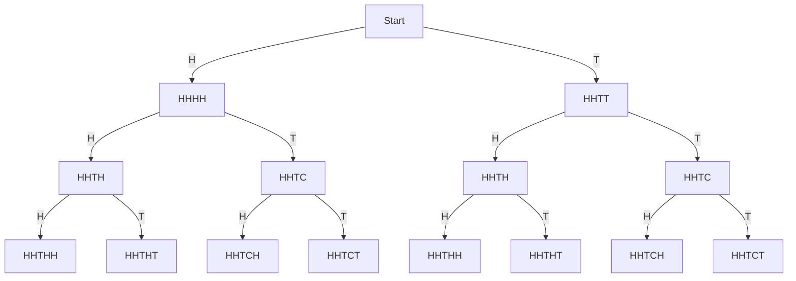
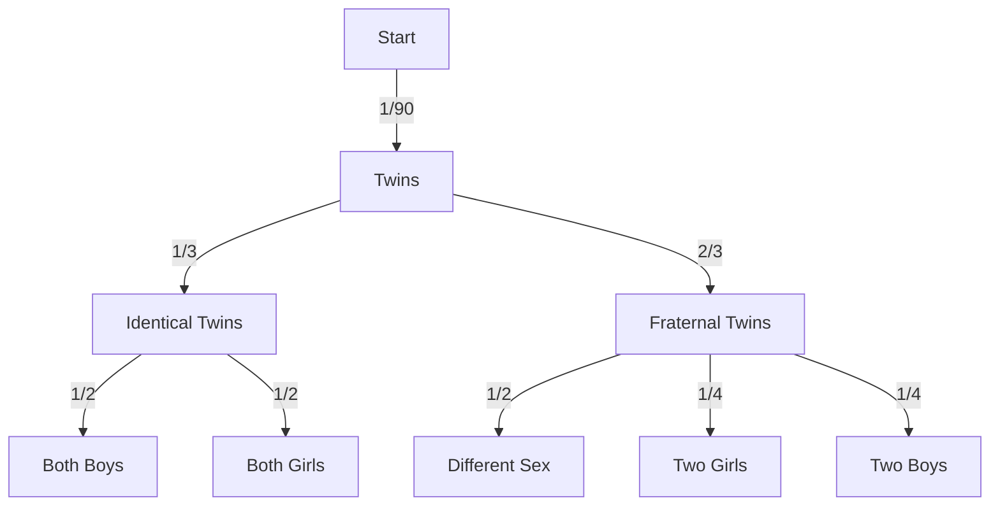

## CH 1 p 1 Describe the sample space of these experiments
Sample space= tutti i possibili outcomes di un esperimento randomico

### Toss a coin four times

HHHH
HHHT
HHTH
HHTT
......
TOTALE: $2^{4}$
### Conta il numero di foglie danneggiate da insetti
S={0,1,2,3,4,-----n} dove n è il numero totale delle foglie

### Misura la vita di una lampadina di un brand in particolare
$S\{0,.....\infty\}=\{t|t>0\}$

## Chapter 1 problem 5

### $A=\{a~US~birth~results~in~twin~females\}=$

$$
1/90 \times (2/3 \times 1/4 + 1/3 \times 1/2)= 1/90 \times 1/6 = 1/540
$$

### $B=\{ a~US~birth~results~in~identical~twins \}$

$$ 1/90 \times 1/3=1/270$$

### $C=\{a~US~birth~results~in~twins \}$
$$1/90$$

## Ch 1 problem 7
