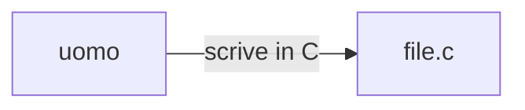
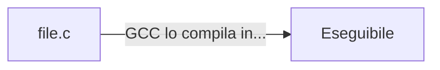
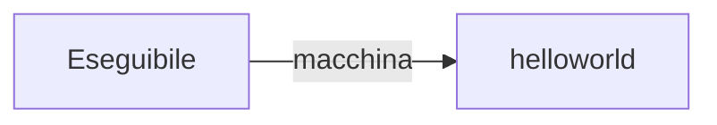

Se quello che stai cercando sono esercizi, vai [[ESERCIZI IN C|qui]]

C è un linguaggio diverso dal python: la prima differenza più evidente è che il "C" è un linguaggio compilato, mentre python no. Cosa significa nel pratico:

Se in python faccio un programma di questo tipo:

```python
print("ciao")
print("come va")
```

L'interprete andrà ad eseguire il programma linea per linea. Lo esegue direttamente "così come è" io devo solo scriverlo, al resto ci pensa python.

Il C invece è un linguaggio compilato: che vuol dire?
Potete immaginare il "C" come una via di mezzo tra la lingua che parliamo noi: il linguaggio naturale, e la lingua che parlano le macchine.



### Nel Pratico:
```C
//scrivo un file C in QUALSIASI editor di testo sul vostro computer

#include<stdio.h>
int main(){
	printf("hello world")
}
```

Questo è un semplice programma che stampa un semplice messaggio (hello world, che fantasia), salvatelo in una cartella sul vostro computer. Per esempio io l'ho salvata in una cartella chiamata "mia cartella":
![[Pasted image 20231121194504.png]]

Ma non basta scrivere un file in C!
La macchina non comprende la roba scritta in C.
Serve un traduttore, qualcosa che prenda il mio file in C e lo trasformi in qualcosa che anche la macchina possa capire.
## Il compilatore: il tuo nuovo migliore amico
Il compilatore fa esattamente questo: prende un file scritto in un linguaggio e lo "compila", cioè lo traduce in un linguaggio che sia comprensibile alla macchina: un **file eseguibile**.
Il compilatore di C, si chiama GCC (Gnu C Compiler).

Cosa fa il compilatore?

Una volta che ho un file eseguibile, la macchina può farlo andare senza problemi.



## Come chiamo il compilatore?
Se sei su VSCode o su code blocks basta che clicchi "compila ed esegui" (bella la vita).

Se invece sei un uomo delle caverne come me, Rossi, e tanti altri individui e sei su linux o macOS:
1. apri il terminale:
![[Pasted image 20231121194850.png]]
La "~" indica che sei nella "home"

2. naviga fino alla cartella dove hai messo il file da compilare
![[Pasted image 20231121195003.png]]
lanciare il comando "ls" ti farà vedere quali file e cartelle ci sono nella cartella (directory) in cui sei ora (che ricordiamo essere la "Home")
in Blu ho le cartelle, in bianco i file, in viola Google Drive (perchè è viola non lo so francamente)
Il mio file sta in una cartella chiamata "la_mia_cartella" che a sua volta sta in una cartella chiamata "c_per_australopitechi" che a sua volta si trova sulla scrivania (Desktop).
Il path completo è:
```bash
"~/Desktop/c_per_australopitechi/la_mia_cartella"
```
Per andarci posso lanciare il comando "cd" che mi fa cambiare directory (CD="change directory")
![[Pasted image 20231121195427.png]]
Come potete vedere, adesso mi trovo nella cartella "la_mia_cartella", ci dovrebbe quindi essere il mio file:
![[Pasted image 20231121195556.png]]
Eccolo lì "prova.c".

3. finalmente chiamo il compilatore
![[Pasted image 20231121195700.png]]
questo dirà al compilatore (gcc) di prendere il file (prova.c). e di creare un file eseguibile che si chiama "prova.out". 
NOTA: se non specifico il nome dell'eseguibile il file si chiamerà semplicemente "a.out"
![[Pasted image 20231121195910.png]]
eccolo lì c'è il mio file eseguibile.

## E ora?
E ora una volta che ho un file eseguibile, che la macchina può capire resta solo una cosa: eseguirlo.
In poche parole devo solo dire alla macchina di mangiare quel file, non devo specificare nient'altro, basta solo chiamare il file con il suo nome. Questo perchè il file è in linguaggio comprensibile alla macchina quindi non serve che chiamo "python" o altre diavolerie per fare in modo che lo capisca.

4. Eseguiamo:
Per eseguire il file basta chiamarlo col suo nome:
![[Pasted image 20231121200013.png]]
il "./" significa "questa cartella" quindi sto chiamando il file di nome "prova.out" che si trova in "questa cartella".
![[Pasted image 20231121200123.png]]

# Congratulazioni
avete fatto il vostro primo programma in C. Che, a differenza del vostro primo programma in python, è in un linguaggio che la vostra macchina capisce veramente.

## Si ok ma perchè dovrei programmare come un uomo delle caverne?
[[Qualche ragione per programmare come un uomo delle caverne|qualche ragione per programmare come un uomo delle caverne e non con degli editor l'ho scritta qui]]
