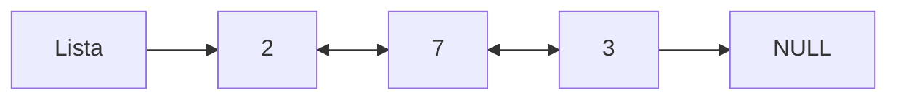
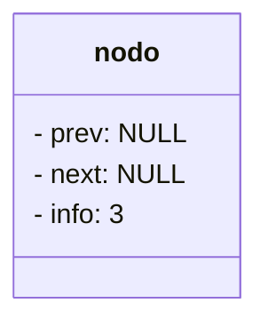
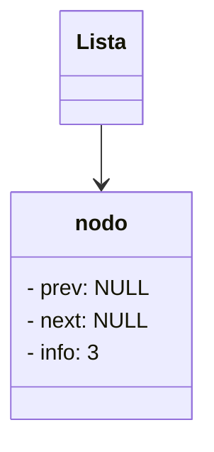
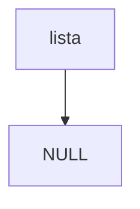
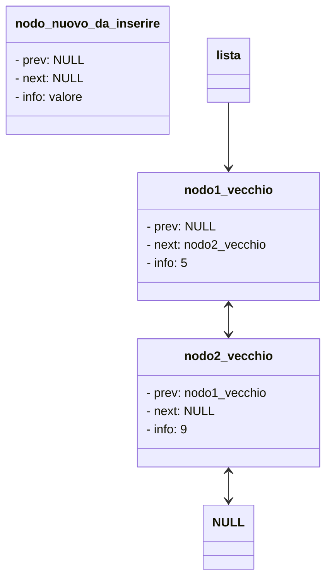

Le liste concatenate sono una struttura dati.
L'idea è quella di inserire i dati concatenandoli gli uni con gli altri tipo così

Potete immaginare le liste concatenate come una specie di "treno" dove ogni nodo contiene un'informazione, e si può passare da un vagone all'altro.
Il vantaggio di usare una struttura dati del genere è che la cancellazione e l'inserimento in testa e in coda hanno tempo costante: capite bene che aggiungere un vagone ad un treno è molto semplice.
La cosa, invece, che non ci piace delle liste concatenate è che la ricerca è sequenziale, cioè per cercare un numero all'interno di questa lista concatenata dobbiamo scorrerla tutta al caso pessimo.
Come potete vedere dal diagramma sopra abbiamo, per ogni elemento della lista non solo una freccia che va "avanti" al prossimo elemento ma anche una che va "indietro". 
## Un nodo:
Ora cominciamo a ragionare col C.
Come possiamo fare per implementare una struttura dati del genere?
Innanzitutto la lista è fatta da elementi, che il prof chiama "nodi".
I nodi sono i "vagoni" del nostro treno, sono tutti uguali e contengono essenzialmente 3 cose:
1. un valore (in questo caso un numero intero)
2. un puntatore all' elemento successivo
3. un puntatore all' elemento precedente

```C
struct nodo{
	float info;
	struct nodo * succ;
	struct nodo * prec;

}typedef struct nodo nodo;

```

Adesso che abbiamo i nostri "nodi", possiamo provare a crearne uno nel main

>[!question]- Crea un nodo e stampa il suo contenuto
>```C
 >#include <stdio.h>
 >#include <stdlib.h>
 >
 >struct nodo{
 >  float info;
 >  struct nodo * succ;
 >  struct nodo * prec;
 >
 >};typedef struct nodo nodo;
 >
 >int main(){
 >
 >  nodo n1; //definisco un nodo chiamato n1
 >  n1.info=3;
 >  n1.succ=NULL;
 >  n1.prec=NULL;
 >
 >  printf("%f",n1.info);
 >
 >}
>```

Okay quindi adesso abbiamo un nodo, cioè un vagone del nostro treno:


Ovviamente è un vagone scollegato, un nodo senza compagno. Insomma si fa fatica a chiamarlo "treno".
Per essere un treno che si rispetti deve come minimo avere una locomotiva, un vagone che indichi "questo è un treno".
In poche parole, ha bisogno di un puntatore, che dica "questo nodo è una lista di un elemento".

Una cosa del genere



Ora basta implementarlo in C:

>[!question]- Implementa la lista di un elemento in C
>```C
>int main(){
 >
 >  nodo n1; //definisco un nodo chiamato n1
 >  n1.info=3;
 >  n1.succ=NULL;
 >  n1.prec=NULL;
 >
 >  nodo * lista;
 >  lista= & n1;
 >  printf("%f",lista -> info);
 >
 >}
 >```
 
 In questo caso abbiamo definito una lista, come un puntatore ad un nodo.
 ```C
 nodo * lista;
 ```
 Abbiamo poi fatto puntare la lista al nodo n1
 ```C
 lista = &n1;
 ```
Abbiamo poi stampato il numero contenuto nel nodo, passando **per la lista, non per l'elemento in se**

Cioè prima avevamo fatto:
```C
printf("%f",n1.info);
```
Mentre ora:
```C
printf("%f",lista -> info);
```

## Cominciamo a fare funzioni
Ok, quindi ora abbiamo una struttura che rappresenta i nodi della lista concatenata:
```C
struct nodo{
	float info;
	struct nodo * succ;
	struct nodo * prec;

}typedef struct nodo nodo;
```
Abbiamo anche dimostrato che questa struttura funziona.
Adesso andiamo a programmarci alcune funzioni che possono esserci utili:

### Lista vuota
La prima cosa che vogliamo è una funzione che ci restituisca una lista vuota.
Abbiamo già detto che una lista non è altro che un puntatore ad un nodo, giusto?
Quindi una lista vuota, non sarà altro che un puntatore che punta a niente: cioè che punta a NULL

>[!question]- fai una funzione che punta ad una lista vuota

Ok, per fare questa cosa dichiariamo una funzione. La funzione prende in input nulla, e restituisce una lista vuota

```C
nodo * lista_vuota(){
	return NULL;
}
```
\*"nodo \*" indica che vogliamo che la funzione restituisca una lista.
Mentre l'output di questa funzione è la lista vuota: NULL;

Creiamo quindi una lista vuota:

```C
#include <stdio.h>
#include <stdlib.h>

struct nodo{
    float info;
    struct nodo * succ;
    struct nodo * prec;

};typedef struct nodo nodo;

nodo * lista_vuota();

int main(){
    nodo * lista= lista_vuota();
}

nodo * lista_vuota(){
    return NULL;
}
```

### Inserimento in testa alla lista

Ok figo, però la nostra lista ora è vuota, è una cosa del genere.

Cioè un puntatore che punta a niente.
Piuttosto triste.
Se vogliamo riempirla evitando di inserire manualmente nel main tutti i nodi come abbiamo fatto nel primo paragrafo, ci serve una funzione che aggiunga nodi a questa lista.

>[!question] Fai una funzione che inserisce un elemento in testa alla lista

Okay, come sempre dobbiamo pensare, quando facciamo una funzione:
1. Cosa prende in input
2. Cosa esce in output

Noi vogliamo dargli in input sicuramente la lista da modificare, vogliamo passargli il valore dell'elemento da aggiungere, e vogliamo avere in output la lista modificata.

Quindi se ad esempio chiamiamo la funzione così:
```C
lista=aggiungiInTesta(lista,35);
```
vorremmo che una volta chiamata così venga aggiunta alla lista il "vagone contenente il numero 35"

Facciamolo:
1. Definiamo la funzione

```C
nodo * aggiungi_in_testa(nodo * lista,float valore){
    //creo un nuovo nodo
    //aggiungo il nodo in testa alla lista
    //ritorno la lista aggiornata
}
```
A costo di essere ridondante: la funzione prende in input una lista ("nodo \* lista"), un valore ("float valore"), e restituisce una lista ("nodo \*" )

2. creo un nuovo nodo


```C
nodo * aggiungi_in_testa(nodo * lista,float valore){
    //creo un nuovo nodo
    nuovo_nodo = malloc(sizeof(nodo));
    //aggiungo il nodo in testa alla lista
    //ritorno la lista aggiornata
}
```
creiamo un nuovo nodo usando la programmazione dinamica (perchè non siamo delle bestie), alloco quindi lo spazio necessario.
Poi lo riempio

```C
nodo * aggiungi_in_testa(nodo * lista,float valore){
    //creo un nuovo nodo
    nodo * n= malloc(sizeof(nodo));
    n->info = valore;
    n->prec=NULL;
    n->succ=NULL;
```

Quindi abbiamo creato un nodo. e abbiamo una lista. Scollegati.
La situazione è una cosa del genere, supponendo che la lista avesse già della roba al suo interno:



```C
nodo * aggiungi_in_testa(nodo * lista,float valore){
    //creo un nuovo nodo
    nodo * n= malloc(sizeof(nodo));
    n->info = valore;
    n->prec=NULL;
    n->succ=NULL;

    //aggiungo il nodo in testa alla lista
    n->succ = lista;
    if (n->succ!=NULL){
        n->succ->prec=n;
    }
    lista=n;

    //ritorno la lista aggiornata
    return lista;
}
```