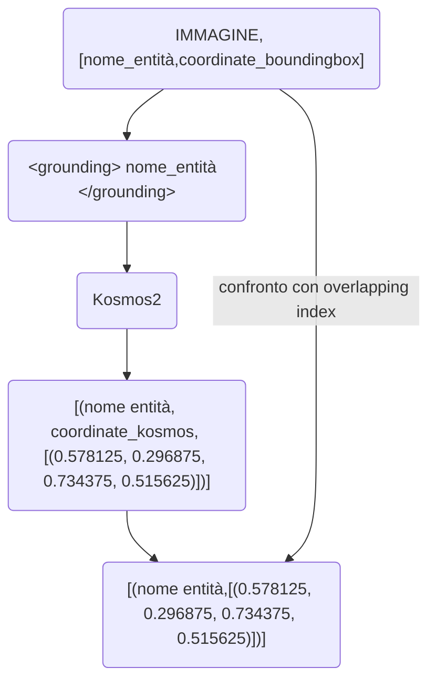

Kosmos prende in input un testo (il prompt) e un'immagine

```python
inputs = processor(text=prompt, images=image, return_tensors="pt")
```

l'output del modello è un testo (che nel paper chiamano hyperlink), che è tipo il seguente (in fondo al codice, la parte commentata):

L'immagine:
![[Pasted image 20231117134140.png]]

il prompt:
```python
prompt = "<grounding>An image of"
```


```python

inputs = processor(text=prompt, images=image, return_tensors="pt")

  

generated_ids = model.generate(

pixel_values=inputs["pixel_values"],

input_ids=inputs["input_ids"][:, :-1],

attention_mask=inputs["attention_mask"][:, :-1],

img_features=None,

img_attn_mask=inputs["img_attn_mask"][:, :-1],

use_cache=True,

max_new_tokens=64,

)

generated_text = processor.batch_decode(generated_ids, skip_special_tokens=True)[0]

  

# Specify `cleanup_and_extract=False` in order to see the raw model generation.

processed_text = processor.post_process_generation(generated_text, cleanup_and_extract=False)

# `<grounding> An image of<phrase> a snowman</phrase><object><patch_index_0044><patch_index_0863></object> warming himself by<phrase> a fire</phrase><object><patch_index_0005><patch_index_0911></object>.`
```

Posso, però chiedere al modello di stampare le entities!

```python
prompt ="<grounding><phrase>God</phrase>"

run_example(prompt,'image2.jpeg')

#God bless the bathroom 
#[('God', (0, 3), [(0.578125, 0.296875, 0.734375, 0.515625)])] 
#<grounding><phrase> God</phrase><object><patch_index_0306><patch_index_0535></object> bless the bathroom

```

\[('God', (0, 3), \[(0.578125, 0.296875, 0.734375, 0.515625)])] 
Che insieme all'entità stampa le coordinate del bounding box classiche

## Di cosa ho bisogno per fare evaluation
Il fine del progetto è fare una evaluation del modello su un dataset di immagini generate da kosmos2.
Il task su cui lo valutiamo, è, inizialmente, quello di entity grounding:
### Entity Grounding
Do in input al modello una entità e un'mmagine e chiedo di fare il grounding, l'output dovrebbe essere un bounding box che corrisponde a quello reale.

Input: immagine, prompt="\<grounding> A snowman \</grounding>"

Output (entities)=\[('A snowman', (0, 3), \[(0.578125, 0.296875, 0.734375, 0.515625)])] 

### Dataset ideale per l'evaluation
Date queste informazioni l'ideale sarebbe avere un dataset composto da immagine ed una lista di tuple da due elementi \[("nome entità", \[coordinate del bounding box])]

In modo tale da poter confrontare l'overlapping index facilmente

## Diagramma di flusso elaborazione del dataset




## Prossimo passo: [[evaluation|evaluation]]
