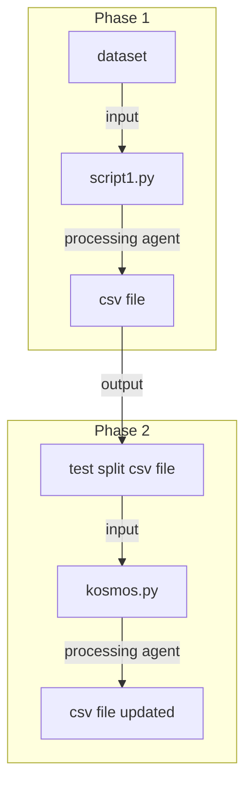

Qui di seguito riporto il processo e il codice utilizzato per creare il dataset su cui poi verrà valutato il modello kosmos2.

Il dataset è stato creato a partire da una serie di ambienti generati proceduralmente in ProcThor.
Il dataset contiene 206 ambienti. Ogni ambiente è identificato con un numero e rappresentato da una directory nel dataset.
All'interno di una directory possiamo trovare:
- un file json
- una directory "images"

Il file json contiene informazioni riguardanti l'ambiente generato. Inoltre è il file che contiene informazioni riguardante gli oggetti presenti nell'ambiente, nonchè i vari bounding box.
Ad esempio, in questa immagine si può vedere le coordinate del bounding box dell'entità di un "TV stand" in una particolare immagine:
![[Pasted image 20231220204904.png]]
All'interno della directory "images" sono invece presenti queste immagini, in due varianti: con bounding box disegnati e senza bounding box.
Per gli scopi di questo progetto abbiamo utilizzato le immagini senza bounding box.

## Fase 1: il primo csv

A questo punto quindi dobbiamo estrarre tutte le informazioni necessarie al nostro progetto ed isolarle in modo tale da poter effettuare una prima valutazione del modello.
Le informazioni di cui necessita il modello sono:
- nome dell'entità di cui fare il grounding
- immagine su cui fare il grounding
- il bounding box dell'oggetto sull'immagine
- le lexical reference dell'oggetto (cioè modi alternativi con cui ci si può riferire all'oggetto)

Queste informazioni sono state estratte utilizzando uno script python, con il quale ho messo queste informazioni in un dataframe, dal quale sono state esportate in un file CSV.
Lo script è il seguente:
```python
import os
import json
import pandas as pd
from PIL import Image
import re

# Function to calculate normalized bounding box coordinates based on image resolution
def calculate_normalized_bbox(resolution, bbox):
    width, height = resolution['width'], resolution['height']
    x1 = bbox['x1'] / width
    y1 = bbox['y1'] / height
    x2 = bbox['x2'] / width
    y2 = bbox['y2'] / height
    return x1, y1, x2, y2

# Function to split camel case or compound words into separate words
def split_entity_type(entity_type):
    return ' '.join(filter(None, re.split(r'([A-Z][a-z]+)', entity_type)))

# Function to process a JSON file and extract relevant information
def process_json_file(directory, file):
    with open(os.path.join(directory, file)) as f:
        data = json.load(f)
    
    objects = data.get("objects", [])
    environment = directory.split("/")[-1]
    
    rows = []
    for obj in objects:
        entity_type = obj.get("assetType", "")
        lexical_references = obj.get("lexical_reference", [])
        
        for image_info in obj.get("images", []):
            bounding_box_path = image_info.get("image", "")
            resolution = image_info.get("resolution", {})
            bounding_box = image_info.get("bounding_box", {})
            
            x1, y1, x2, y2 = calculate_normalized_bbox(resolution, bounding_box)
            
            # Modify bounding box image path
            bounding_box_dir, image_name = os.path.split(bounding_box_path)
            image_path_bbox = os.path.join(bounding_box_dir.replace("bounding_box", "normal"),
                                           image_name.replace("bounding_box_", ""))
            image_path_normal = os.path.join(bounding_box_dir.replace("bounding_box", "normal"),
                                             image_name.replace("bounding_box_", ""))
            
            rows.append({
                "environment": environment,
                "entity_type": split_entity_type(entity_type),
                "lexical_references": lexical_references,
                "image_bbox": os.path.join(directory, bounding_box_path),
                "image_normal": os.path.join(directory, image_path_normal),
                "bounding_box": (x1, y1, x2, y2)
            })

    return rows

# Main function to process all JSON files in the specified directories
def process_directories(directories):
    data_rows = []
    
    for directory in directories:
        json_files = [f for f in os.listdir(directory) if f.endswith(".json")]
        
        for json_file in json_files:
            data_rows.extend(process_json_file(directory, json_file))
    
    return data_rows

# Define the list of directories
# Omitted for simplicity
directories = [
...
]

# Process directories and create DataFrame
data = process_directories(directories)
df = pd.DataFrame(data)

# Export DataFrame to CSV
csv_filename = "output_data.csv"
df.to_csv(csv_filename, index=False)

print(f"DataFrame exported to {csv_filename}")


```
Questo script, quindi processa ogni directory degli ambienti, e per ogni file json estrae, per ogni entità la posizione in ogni immagine.
Questo è un estratto del file csv, output di questa fase:
![[Pasted image 20231220210811.png]]
Il file completo ha circa 13000 entries.

## Fase 2: Zero shot evaluation

A questo punto questo file viene diviso in due: Test split e Training split.
In questa fase utilizzeremo kosmos per generare il bounding box del "Test split". Questa è una valutazione senza fine tuning, che potremmo definire "Zero shot".
L'input di questa fase è il Test split dell'output della fase precedente, mentre L'output è un nuovo file csv che contiene anche le informazioni del bounding box generato da kosmos.

Kosmos ovviamente non prende in input un file csv. Il modello, prende in input un prompt e un'immagine, e, ci fornirà il bounding box dell'entità di cui abbiamo chiesto il grounding.

ES:
Input:
1. Prompt:
![[Pasted image 20231220212039.png]]
2. image:
![[Pasted image 20231220212214.png]]
output:

![[Pasted image 20231220212308.png]]

Quindi come per ogni entry del csv dobbiamo:
1. generare un prompt 
2. rimediare l'immagine relativa
4. estrarre dall'output di kosmos il bounding box relativo all'entità di cui ha fatto il grounding
5. Valutare la bontà del bounding box generato
6. Aggiornare il csv

Tutto questo viene fatto con il seguente script:

```python
import xml.etree.ElementTree as ET
from PIL import Image
import os
import torch
import pandas as pd
import numpy as np
import re

def overlap_area(box1, box2):
    """
    Calculate the overlapping area between two bounding boxes.
    The input boxes should be in the format (xmin, ymin, xmax, ymax).
    """
    x_min = max(box1[0], box2[0])
    y_min = max(box1[1], box2[1])
    x_max = min(box1[2], box2[2])
    y_max = min(box1[3], box2[3])

    width = max(0, x_max - x_min)
    height = max(0, y_max - y_min)

    return width * height

def overlapping_index(box1, box2):
    """
    Calculate the overlapping index (IoU) between two bounding boxes.
    The input boxes should be in the format (xmin, ymin, xmax, ymax).
    """
    area1 = (box1[2] - box1[0]) * (box1[3] - box1[1])
    area2 = (box2[2] - box2[0]) * (box2[3] - box2[1])

    overlap = overlap_area(box1, box2)
    union = area1 + area2 - overlap

    return overlap / union if union > 0 else 0

def extract_entities_from_xml(xml_file):
    entities = []
    tree = ET.parse(xml_file)
    root = tree.getroot()

    object_elements = root.findall(".//object")
    for object_element in object_elements:
        entity_name = object_element.find("name").text
        xmin = float(object_element.find("bndbox/xmin").text)
        ymin = float(object_element.find("bndbox/ymin").text)
        xmax = float(object_element.find("bndbox/xmax").text)
        ymax = float(object_element.find("bndbox/ymax").text)

        # Normalize coordinates
        xmin_normalized = xmin / image_width
        ymin_normalized = ymin / image_height
        xmax_normalized = xmax / image_width
        ymax_normalized = ymax / image_height

        entities.append((entity_name, (xmin_normalized, ymin_normalized, xmax_normalized, ymax_normalized)))

    return entities

def generate_prompt(entity_type):
    prompt = f"<grounding><phrase>{entity_type}</phrase>"
    return [prompt]

def process_image_with_kosmos(prompt, image_path):

    try:
        image = Image.open("/content/drive/MyDrive/NewKosmos/kosmos_project/dataset/"+image_path)
    except FileNotFoundError:
        print(f"File not found: {image_path}. Skipping this row.")
        return None

    inputs = processor(text=prompt, images=image, return_tensors="pt")

    generated_ids = model.generate(
        pixel_values=inputs["pixel_values"],
        input_ids=inputs["input_ids"][:, :-1],
        attention_mask=inputs["attention_mask"][:, :-1],
        img_features=None,
        img_attn_mask=inputs["img_attn_mask"][:, :-1],
        use_cache=True,
        max_new_tokens=64,
    )
    generated_text = processor.batch_decode(generated_ids, skip_special_tokens=True)[0]

    processed_text, kosmos_entities = processor.post_process_generation(generated_text)
    print(kosmos_entities)

    return kosmos_entities


def eval_instance(df_row, debug=False):
    # Extract information from the DataFrame row
    image_path = df_row["image_normal"]
    labeled_box_str = df_row["bounding_box"]

    # Convert bounding box values from string to float
    labeled_box = tuple(map(float, re.findall(r'\d+\.\d+', labeled_box_str)))

    # Generate prompt using the "entity type" entry of the DataFrame
    entity_type = df_row["entity_type"]
    prompts = generate_prompt(entity_type)

    # Process image with Kosmos and get entities
    kosmos_entities = process_image_with_kosmos(prompts[0], image_path)
    if debug:
        print(kosmos_entities)

    # Initialize result_row with default values
    result_row = {
        "kosmos_bounding_box": np.NaN,
        "overlap_index": 0.0,
        "Match": False
    }

    # Compare entities and calculate overlapping index
    if kosmos_entities is None:
        return result_row
    for kosmos_entity in kosmos_entities:
        _, _, kosmos_boxes = kosmos_entity
        for kosmos_box in kosmos_boxes:
            # Convert Kosmos bounding box values from string to float
            #kosmos_box = tuple(map(float, re.findall(r'\d+\.\d+', kosmos_box_str)))
            overlap_index = overlapping_index(labeled_box, kosmos_box)
            result_row["kosmos_bounding_box"] = kosmos_box  # Convert bounding box back to string?
            result_row["overlap_index"] = overlap_index
            result_row["Match"] = overlap_index > 0.5
            if result_row["Match"]:
                print(f"Entity matched with an overlapping index of: {overlap_index}")
                return result_row

    return result_row

def main():
    df = pd.read_csv("/content/drive/MyDrive/NewKosmos/kosmos_project/dataset/output_data.csv")

    # Initialize new columns
    df["kosmos_bounding_box"] = ""
    df["overlap_index"] = 0.0
    df["Match"] = False

    for index, row in df.iterrows():
        result_row = eval_instance(row)
        # Update DataFrame with new values
        df.loc[index, ["kosmos_bounding_box", "overlap_index", "Match"]] = result_row.values()
        if result_row["Match"]:
            print(f"Image at index {index} has a match.")
        else:
            print(f"No match found for image at index {index}.")

        # Save updated DataFrame to CSV every 10 images
        if index % 10 == 0 and index > 0:
            df.to_csv("/content/drive/MyDrive/NewKosmos/kosmos_project/dataset/output_data_updated.csv", index=False)
            print(f"Exported DataFrame to CSV after processing {index} images.")

    # Save the final updated DataFrame to a new CSV file
    df.to_csv("/content/drive/MyDrive/NewKosmos/kosmos_project/dataset/output_data_updated_final.csv", index=False)

if __name__ == "__main__":
    main()

```

L'output di questa fase è un file csv aggiornato con l'output di kosmos.
In più rispetto alla fase precedente ci sono altre tre colonne:
- "kosmos bounding box": il bounding box generato da kosmos
- overlap index: il coefficiente che indica la percentuale di sovrapposizione tra il bounding box di kosmos e il target bounding box
- Match: un valore booleano che indica se c'è un match tra i due bounding box (si ha un match quando i due BB si sovrappongono per più del 50%)
![[Pasted image 20231220213113.png]]

## Fase 3: valutazione delle performance zero shot

Usando un altro semplice script possiamo valutare la performance del modello in zero shot.

```python
import pandas as pd

def calculate_match_percentage(csv_path):
    # Read the updated CSV file
    df = pd.read_csv(csv_path)

    # Count the number of matches
    num_matches = df[df["Match"]].shape[0]

    # Calculate the percentage of matches
    total_images = df.shape[0]
    match_percentage = (num_matches / total_images) * 100

    print(f"Number of matches: {num_matches}")
    print(f"Total images processed: {total_images}")
    print(f"Match percentage: {match_percentage:.2f}%")

if __name__ == "__main__":
    updated_csv_path = "/content/drive/MyDrive/NewKosmos/kosmos_project/dataset/output_data_updated_final.csv"
    calculate_match_percentage(updated_csv_path)

```


## Diagramma di flusso delle fasi


